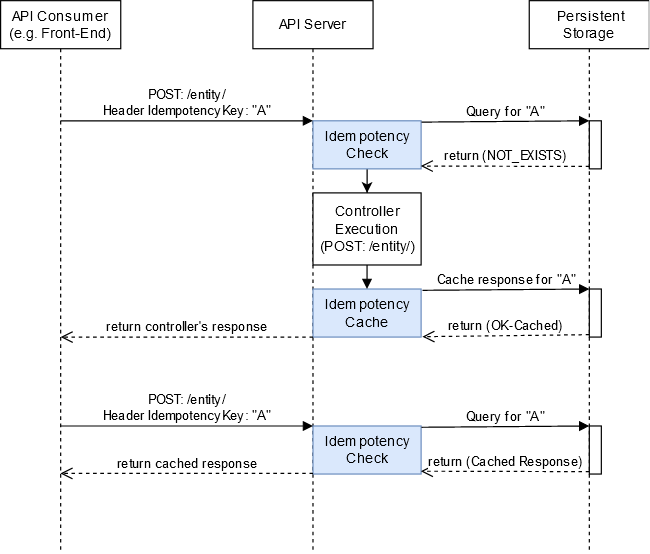

# Idempotent API (v2.2.0)


## Understanding Idempotency

A [distributed system](https://en.wikipedia.org/wiki/Distributed_computing) consists of multiple components located on different networked computers, which communicate and coordinate their actions by passing messages to one another from any system. For example, I am sure that you have heard of the [microservices](https://microservices.io/) architecture, which is a kind of distributed system.

Creating Web APIs for distributed systems is challenging because of distribution pitfalls such as process failures, communication failures, asynchrony, and concurrency. One common requirement and challenge when building [fault-tolerant distributed applications](https://www.microsoft.com/en-us/research/publication/fault-tolerance-via-idempotence/) is the need to be idempotent.

- In mathematics and computer science, an operation is [idempotent](https://en.wikipedia.org/wiki/Idempotence) when applied multiple times without changing the result beyond the initial application.
- [Fault-tolerant](https://en.wikipedia.org/wiki/Software_fault_tolerance) applications can continue operating despite the system, hardware, and network faults of one or more components, ensuring [high availability](https://en.wikipedia.org/wiki/High_availability_software) and [business continuity](https://en.wikipedia.org/wiki/Business_continuity_planning) for critical applications or systems.

Idempotence in Web APIs ensures that the API works correctly (as designed) even when consumers (clients) send the same request multiple times. For example, this case can happen when the API failed to generate the response (due to process failures, temporary downtime, etc.) or because the response was generated but could not be transferred (network issues).

Imagine a scenario in which the user clicks a “Pay” button to make a purchase. For unknown reasons, the user receives an error, but the payment was completed. If the user clicks the “Pay” button again or the request is re-sent by a retry library, we would result in two payments! Using idempotency, the user will get a successful message (e.g., on the second try), but only one charge would be performed.

Creating Idempotent Web APIs is the first step before using a resilient and transient-fault-handling library, such as [Polly](https://github.com/App-vNext/Polly). The Polly .NET library allows developers to express policies such as Retry, Circuit Breaker, Timeout, Bulkhead Isolation, and Fallback in a fluent and thread-safe manner.

The `IdempotentAPI` library provides an easy way to develop idempotent Web APIs. In the following sections, we will see the idempotency in the different HTTP methods, how the `IdempotentAPI` library works, its code, and finally, how to use the `IdempotentAPI` NuGet packages.


## Idempotency in HTTP (Web)

HTTP defines a set of request [methods](https://developer.mozilla.org/en-US/docs/Web/HTTP/Methods) (HTTP verbs: GET, POST, PUT, PATCH, etc.) to indicate the desired action to be performed for a given resource. An idempotent HTTP method can be called many times without resulting in different outcomes. Safe methods are HTTP methods that do not modify the resources. In Table 1, we can see details about which HTTP methods are idempotent or/and safe.

*Table 1. - Idempotent or/and Safe HTTP methods (verbs).*

| **HTTP Method** | **Idempotent** | **Safe** | **Description**                                              |
| --------------- | -------------- | -------- | ------------------------------------------------------------ |
| GET             | Yes            | Yes      | Safe HTTP methods do not modify resources. Thus, multiple calls  with this method will always return the same response. |
| OPTIONS         | Yes            | Yes      | Same as the previous HTTP method.                            |
| HEAD            | Yes            | Yes      | Same as the previous HTTP method.                            |
| PUT             | Yes            | No       | The PUT HTTP method is idempotent because calling this HTTP  method multiple times (with the same request data) will update the same  resource and not change the outcome. |
| DELETE          | Yes            | No       | The DELETE HTTP method is idempotent because calling this HTTP  method multiple times will only delete the resource once. Thus, numerous  calls of the DELETE HTTP method will not change the outcome. |
| POST            | **No**         | No       | Calling the POST method multiple times can have different  results and will create multiple resources. For that reason, the POST method  is **not**  idempotent. |
| PATCH           | **No**         | No       | The PATCH method can be idempotent depending on the  implementation, but it isn’t required to be. For that reason, the PATCH  method is **not**  idempotent. |

### Idempotent Web Consumer

The creation of an `idempotent consumer` is an essential factor in HTTP idempotency. The API server would need a way to recognize subsequent retries of the same request. Commonly, the consumer generates a unique value, called [idempotency-key](https://tools.ietf.org/id/draft-idempotency-header-01.html#section-2), which the API server uses for that purpose. In addition, when building an idempotent consumer, it is recommended to:

- Use "[V4 UUIDs](https://en.wikipedia.org/wiki/Universally_unique_identifier)" for the creation of the idempotency unique keys (e.g. “07cd2d27-e0dc-466f-8193-28453e9c3023”).
- Use techniques like the [exponential backoff and random jitter](https://aws.amazon.com/blogs/architecture/exponential-backoff-and-jitter/), i.e., including an exponential and random delay between continuous requests.

 

## The IdempotentAPI Library

The `IdempotentAPI` is an open-source NuGet library, which implements an ASP.NET Core attribute ([filter](https://www.dotnetnakama.com/blog/creating-and-testing-asp-dotnet-core-filter-attributes/)) to handle the HTTP write operations (POST and PATCH) that can affect only once for the given request data and idempotency-key.

### How IdempotentAPI Works

The API consumer (e.g., a Front-End website) sends a request including an Idempotency-Key header unique identifier (default name: `IdempotencyKey`). The API server checks if that unique identifier has been used previously for that request and either returns the cached response (without further execution) or save-cache the response along with the unique identifier. The cached response includes the HTTP status code, the response body, and headers.

Storing data is necessary for idempotency, but if the data are not expired after a certain period, it will include unneeded complexity in data storage, security, and scaling. Therefore, the data should have a retention period that makes sense for your problem domain.

The `IdempotentAPI` library performs additional validation of the request’s hash-key to ensure that the cached response is returned for the same combination of Idempotency-Key and Request to prevent accidental misuse.

The following figure shows a simplified example of the `IdempotentAPI` library flow for two exact POST requests. As shown, the `IdempotentAPI` library includes two additional steps, one before the controller’s execution and one after constructing the controller’s response.



*Figure 1. - A simplified example of the `IdempotentAPI` flow for two exact POST requests.*


## ✔ Features

- ⭐ **Simple**: Support idempotency in your APIs easily with simple steps 1️⃣2️⃣3️⃣.
- 🔍 **Validations**: Performs validation of the request’s hash-key to ensure that the cached response is returned for the same combination of Idempotency-Key and Request to prevent accidental misuse.
- 🌍 **Use it anywhere!**: `IdempotentAPI` targets .NET Standard 2.0. So, we can use it in any compatible .NET implementation (.NET Framework, .NET Core, etc.). Click [here](https://docs.microsoft.com/en-us/dotnet/standard/net-standard#net-implementation-support) to see the minimum .NET implementation versions that support each .NET Standard version.
- ⚙ **Configurable**: Customize the idempotency in your needs.
    - Configuration Options (see [below](#idempotent-attribute-options) for more details)
    - Logging Level configuration
- 🔧 **Caching Implementation based on your needs.**
    - 🏠 `DistributedCache`:  A build-in caching that is based on the standard `IDistributedCache` interface.
    - 🦥 [FusionCache](https://github.com/jodydonetti/ZiggyCreatures.FusionCache):   A high performance and robust cache with an optional distributed 2nd layer and some advanced features.
    - ... or you could use your own implementation 😉
- 🔀 Support idempotency in a **Cluster Environment** (i.e., a group of multiple server instances) using **Distributed Locks**.
    - [samcook/RedLock.net](https://github.com/samcook/RedLock.net): Supports the [Redis Redlock](https://redis.io/docs/reference/patterns/distributed-locks/) algorithm.
    - [madelson/DistributedLock](https://github.com/madelson/DistributedLock): Supports multiple technologies such as Redis, SqlServer, Postgres and many [more](https://github.com/madelson/DistributedLock#implementations).
- 💪**Powerful**: Can be used in high-load scenarios.
- ✳ **NEW** ✳ - ✅ Supports Minimal APIs.


## 📦 Main NuGet Packages (v2.2.0)

| Package Name                                                 | Description                                                  | Release                                                      |
| ------------------------------------------------------------ | ------------------------------------------------------------ | ------------------------------------------------------------ |
| [IdempotentAPI](https://www.nuget.org/packages/IdempotentAPI/) | The implementation of the  `IdempotentAPI` library.          | [](https://www.nuget.org/packages/IdempotentAPI/) |
| [IdempotentAPI.AccessCache](https://www.nuget.org/packages/IdempotentAPI.AccessCache/) | The access cache implementation of the `IdempotentAPI` project. | [](https://www.nuget.org/packages/IdempotentAPI.AccessCache/) |
| [IdempotentAPI.MinimalAPI](https://www.nuget.org/packages/IdempotentAPI.MinimalAPI) | The implementation to support `IdempotentAPI` in Minimal APIs. | [](https://www.nuget.org/packages/IdempotentAPI.MinimalAPI) |


## 📦 Caching NuGet Packages (v2.2.0)

| Package Name                                                 | Description                                                  | Release                                                      |
| ------------------------------------------------------------ | ------------------------------------------------------------ | ------------------------------------------------------------ |
| [IdempotentAPI.Cache.Abstractions](https://www.nuget.org/packages/IdempotentAPI.Cache.Abstractions/) | The cache definition of the IdempotentAPI project.           | [](https://www.nuget.org/packages/IdempotentAPI.Cache.Abstractions/) |
| [IdempotentAPI.Cache.DistributedCache](https://www.nuget.org/packages/IdempotentAPI.Cache.DistributedCache/) | The default caching implementation, based on the standard `IDistributedCache` interface. | [](https://www.nuget.org/packages/IdempotentAPI.Cache.DistributedCache/) |
| [IdempotentAPI.Cache.FusionCache](https://www.nuget.org/packages/IdempotentAPI.Cache.FusionCache/) | Supports caching via the [FusionCache](https://github.com/jodydonetti/ZiggyCreatures.FusionCache) third-party library. | [](https://www.nuget.org/packages/IdempotentAPI.Cache.FusionCache/) |


## 📦 Distributed Locking NuGet Packages (v2.1.0)

| Package Name                                                 | Description                                                  | Release                                                      |
| ------------------------------------------------------------ | ------------------------------------------------------------ | ------------------------------------------------------------ |
| [IdempotentAPI.DistributedAccessLock.Abstractions](https://www.nuget.org/packages/IdempotentAPI.DistributedAccessLock.Abstractions/) | The distributed access lock definition of the IdempotentAPI project. | [](https://www.nuget.org/packages/IdempotentAPI.DistributedAccessLock.Abstractions/) |
| [IdempotentAPI.DistributedAccessLock.MadelsonDistributedLock](https://www.nuget.org/packages/IdempotentAPI.DistributedAccessLock.MadelsonDistributedLock/) | The Madelson DistributedLock implementation for the definition of the IdempotentAPI.DistributedAccessLock. | [](https://www.nuget.org/packages/IdempotentAPI.DistributedAccessLock.MadelsonDistributedLock/) |
| [IdempotentAPI.DistributedAccessLock.RedLockNet](https://www.nuget.org/packages/IdempotentAPI.DistributedAccessLock.RedLockNet/) | The RedLockNet implementation for the definition of the IdempotentAPI.DistributedAccessLock. | [](https://www.nuget.org/packages/IdempotentAPI.DistributedAccessLock.RedLockNet/) |


## 🌟 Quick Start

Let's see how we could use the NuGet packages in a Web API project. For more examples and code, you can check the [sample projects](https://github.com/ikyriak/IdempotentAPI/tree/master/samples). The `IdempotentAPI` can be installed via the NuGet UI or the NuGet package manager console:

```powershell
PM> Install-Package IdempotentAPI -Version 2.2.0
```

and, register the IdempotentAPI Core services:

```c#
services.AddIdempotentAPI();
```


### Step 1️⃣.🅰: Register the Caching Storage

As we have seen, storing-caching data is necessary for idempotency. Therefore, the IdempotentAPI library needs an implementation of the `IIdempotencyCache` to be registered in the `Program.cs` or `Startup.cs` file depending on the used style (.NET 6.0 or older). The `IIdempotencyCache` defines the caching storage service for the idempotency needs.

Currently, we support the following two implementations (see the following table). However, you can use your implementation 😉. Both implementations support the `IDistributedCache` either as primary caching storage (require its registration) or as secondary (optional registration).

Thus, we can define our caching storage service in the `IDistributedCache`, such as in Memory, SQL Server, Redis, NCache, etc. See the [Distributed caching in the ASP.NET Core](https://docs.microsoft.com/en-us/aspnet/core/performance/caching/distributed?view=aspnetcore-5.0#establish-distributed-caching-services) article for more details about the available framework-provided implementations.

|                                                              | Support Concurrent Requests | Primary Cache     |      2nd-Level Cache       | Advanced Features |
| ------------------------------------------------------------ | :-------------------------: | ----------------- | :------------------------: | :---------------: |
| [IdempotentAPI.Cache.DistributedCache](https://www.nuget.org/packages/IdempotentAPI.Cache.DistributedCache/) (Default) |              ✔️              | IDistributedCache |             ❌              |         ❌         |
| [IdempotentAPI.Cache.FusionCache](https://www.nuget.org/packages/IdempotentAPI.Cache.FusionCache/) |              ✔️              | Memory Cache      | ✔️<br />(IDistributedCache) |         ✔️         |


#### Choice 1 (Default):  IdempotentAPI.Cache.DistributedCache

Install the `IdempotentAPI.Cache.DistributedCache` via the NuGet UI or the NuGet package manager console.

```c#
// Register an implementation of the IDistributedCache.
// For this example, we are using a Memory Cache.
services.AddDistributedMemoryCache();

// Register the IdempotentAPI.Cache.DistributedCache.
services.AddIdempotentAPIUsingDistributedCache();
```


#### Choice 2: Registering: IdempotentAPI.Cache.FusionCache

Install the `IdempotentAPI.Cache.FusionCache` via the NuGet UI or the NuGet package manager console. To use the advanced `FusionCache` features (2nd-level cache, Fail-Safe, Soft/Hard timeouts, etc.), configure the  `FusionCacheEntryOptions` based on your needs (for more details, visit the [FusionCache repository](https://github.com/jodydonetti/ZiggyCreatures.FusionCache)).

```c#
// Register the IdempotentAPI.Cache.FusionCache.
// Optionally: Configure the FusionCacheEntryOptions.
services.AddIdempotentAPIUsingFusionCache();
```


💡 **TIP**: To use the **2nd-level cache**, we should register an implementation for the `IDistributedCache` and register the FusionCache Serialization ([NewtonsoftJson](https://www.nuget.org/packages/ZiggyCreatures.FusionCache.Serialization.NewtonsoftJson/) or [SystemTextJson](https://www.nuget.org/packages/ZiggyCreatures.FusionCache.Serialization.SystemTextJson/)). For example, check the following code example:

```c#
// Register an implementation of the IDistributedCache.
// For this example, we are using Redis.
services.AddStackExchangeRedisCache(options =>
{
    options.Configuration = "YOUR CONNECTION STRING HERE, FOR EXAMPLE:localhost:6379";
});

// Register the FusionCache Serialization (e.g. NewtonsoftJson).
// This is needed for the a 2nd-level cache.
services.AddFusionCacheNewtonsoftJsonSerializer();

// Register the IdempotentAPI.Cache.FusionCache.
// Optionally: Configure the FusionCacheEntryOptions.
services.AddIdempotentAPIUsingFusionCache();
```


### Step 1️⃣.🅱: Register the Distributed Locks for Cluster Environment (Optional)

Currently, we support the following two implementations to support idempotency in a **Cluster Environment** (i.e., a group of multiple server instances) using **Distributed Locks**. 

The `DistributedLockTimeoutMilli` attribute option should be used to set the time the distributed lock will wait for the lock to be acquired (in milliseconds).

|                                                              | Supported Technologies                                       |
| ------------------------------------------------------------ | ------------------------------------------------------------ |
| [samcook/RedLock.net](https://github.com/samcook/RedLock.net) | [Redis Redlock](https://redis.io/docs/reference/patterns/distributed-locks/) |
| [madelson/DistributedLock](https://github.com/madelson/DistributedLock) | Redis, SqlServer, Postgres and many [more](https://github.com/madelson/DistributedLock#implementations). |


#### Choice 1:  None

If you do not need to support idempotency in a Cluster Environment, you do not have to register anything. So, skip this step 😉.


#### Choice 2:  samcook/RedLock.net (Redis)

Install the `IdempotentAPI.DistributedAccessLock.RedLockNet` via the NuGet UI or the NuGet package manager console. The [samcook/RedLock.net](https://github.com/samcook/RedLock.net) supports the [Redis Redlock](https://redis.io/docs/reference/patterns/distributed-locks/) algorithm.

```c#
// Define the Redis endpoints:
List<DnsEndPoint> redisEndpoints = new List<DnsEndPoint>()
{
	new DnsEndPoint("localhost", 6379)
};

// Register the IdempotentAPI.DistributedAccessLock.RedLockNet:
services.AddRedLockNetDistributedAccessLock(redisEndpoints);
```


#### Choice 3:  madelson/DistributedLock (Multiple Techonologies)

Install the `IdempotentAPI.DistributedAccessLock.MadelsonDistributedLock` via the NuGet UI or the NuGet package manager console. The [madelson/DistributedLock](https://github.com/madelson/DistributedLock) supports multiple technologies such as Redis, SqlServer, Postgres and many [more](https://github.com/madelson/DistributedLock#implementations).

```c#
// Register the distributed lock technology.
// For this example, we are using Redis.
var redicConnection = ConnectionMultiplexer.Connect("localhost:6379");
services.AddSingleton<IDistributedLockProvider>(_ => new RedisDistributedSynchronizationProvider(redicConnection.GetDatabase()));

// Register the IdempotentAPI.DistributedAccessLock.MadelsonDistributedLock
services.AddMadelsonDistributedAccessLock();
```


### Step 2️⃣: Decorate Response Classes as Serializable

The response Data Transfer Objects (DTOs) need to be serialized before caching. For that reason, we will have to decorate the relative DTOs as `[Serializable]`. For example, see the code below.

```c#
using System;

namespace WebApi_3_1.DTOs
{
    [Serializable]
    public class SimpleResponse
    {
        public int Id { get; set; }
        public string Message { get; set; }
        public DateTime CreatedOn { get; set; }
    }
}
```


### Step 3️⃣: Set Controller Operations as Idempotent

In your `Controller` class, add the following using statement. Then choose which operations should be Idempotent by setting the `[Idempotent()]` attribute, either on the controller’s class or on each action separately. The following two sections describe these two cases. However, we should define the `Consumes` and `Produces` attributes on the controller in both cases.

```c#
using IdempotentAPI.Filters;
```


#### Using the Idempotent Attribute on a Controller’s Class

By using the Idempotent attribute on the API Controller’s Class, **all** POST and PATCH actions will work as idempotent operations (requiring the `IdempotencyKey` header).

```c#
[ApiController]
[Route("[controller]")]
[Consumes("application/json")] // We should define this.
[Produces("application/json")] // We should define this.
[Idempotent(Enabled = true)]
public class SimpleController : ControllerBase
{
    // ...
}
```

 

#### Using the Idempotent Attribute on a Controller’s Action

By using the Idempotent attribute on each action (HTTP POST or PATCH), we can choose which of them should be Idempotent. In addition, we could use the Idempotent attribute to set different options per action.

```c#
[HttpPost]
[Idempotent(ExpireHours = 48)]
public IActionResult Post([FromBody] SimpleRequest simpleRequest)
{
    // ...
}
```

 

#### Using the IdempotentAPI Endpoint Filter on Minimal APIs

The [IdempotentAPI.MinimalAPI](https://www.nuget.org/packages/IdempotentAPI.MinimalAPI) package should be installed and then add the `IdempotentAPIEndpointFilter` in your endpoints.

```c#
app.MapPost("/example",
    ([FromQuery] string yourParam) =>
    {
        return Results.Ok(new ResponseDTOs());
    })
    .AddEndpointFilter<IdempotentAPIEndpointFilter>();
```


### ⚙ Idempotent Attribute Options

The Idempotent attribute provides a list of options, as shown in the following table.

*Table 2. - Idempotent attribute options*

| **Name**                    | **Type** | **Default Value** | **Description**                                              |
| --------------------------- | -------- | ----------------- | ------------------------------------------------------------ |
| Enabled                     | bool     | true              | Enable or Disable the Idempotent operation on an API Controller’s  class or method. |
| ExpireHours (Obsolete)      | int      | 24 hours          | The retention period (in hours) of the idempotent cached data. This option will be deprecated. |
| ExpiresInMilliseconds       | double   | 24 hours          | The retention period (in milliseconds) of the idempotent cached data. |
| HeaderKeyName               | string   | IdempotencyKey    | The name of the Idempotency-Key header.                      |
| DistributedCacheKeysPrefix  | string   | IdempAPI_         | A prefix for the DistributedCache key names.                 |
| CacheOnlySuccessResponses   | bool     | True              | When true, only the responses with 2xx HTTP status codes will be cached. |
| DistributedLockTimeoutMilli | double   | NULL              | The time the distributed lock will wait for the lock to be acquired (in milliseconds). This is Required when a `IDistributedAccessLockProvider` is provided. |
| IsIdempotencyOptional       | bool     | False             | Set the idempotency as optional to be introduced to existing endpoints easily (which should be backward compatible). |

 

### 📚 The Source Code (IdempotentAPI)

Let’s have a quick look at the `IdempotentAPI` project and its main code files.

- **/Core/Idempotency.cs**: The core implementation containing the idempotency logic applied before and after the request’s execution.
- **/Filters/IdempotencyAttributeFilter.cs**: The filter implementation (of `IActionFilter` and `IResultFilter`) uses the core implementation on specific steps of the filter pipeline execution flow.
- **/Filters/IdempotencyAttribute.cs**: The idempotency attribute implementation for its input options and to initialize the idempotency filter.
- **/Helpers/Utils.cs**: Several helper static functions for serialization, hashing, and compression.


## 📑 Summary

A distributed system consists of multiple components located on different networked computers, which communicate and coordinate their actions by passing messages to one another from any system. As a result, fault-tolerant applications can continue operating despite the system, hardware, and network faults of one or more components.

Idempotency in Web APIs ensures that the API works correctly (as designed) even when consumers (clients) send the same request multiple times. Applying idempotency in our APIs is the first step before using a resilient and transient-fault-handling library, such as [Polly](https://github.com/App-vNext/Polly).

The `IdempotentAPI` is an open-source [NuGet library](https://www.nuget.org/packages/IdempotentAPI/), which implements an ASP.NET Core attribute (filter) to handle the HTTP write operations (POST and PATCH) that can affect only once for the given request data and idempotency-key.

To ensure high availability and business continuity of your critical Web APIs, the `IdempotentAPI` library is your first step 😉. Any help in coding, suggestions, giving a GitHub Star ⭐, etc., are welcome.


## 📜 License
The `IdempotentAPI` is [MIT licensed](./LICENSE.md).
